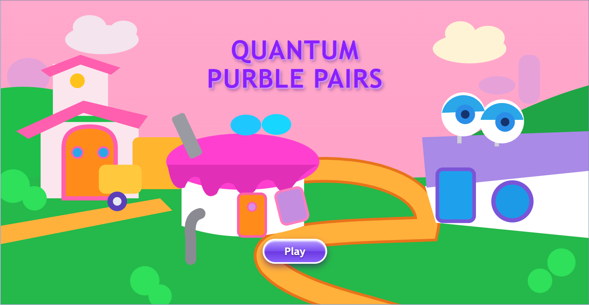
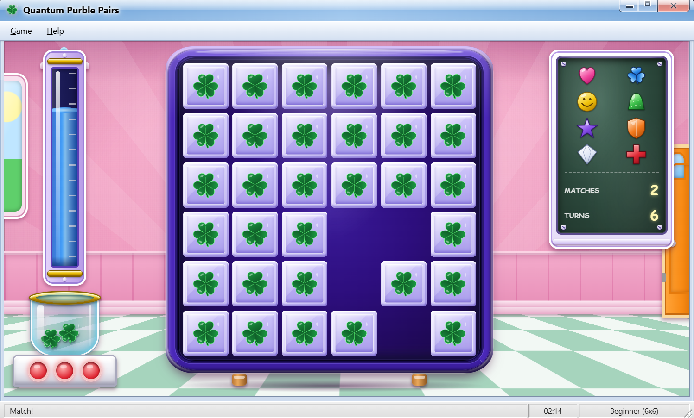

# Quantum Purble Pairs

A memory-matching game styled after the Windows 7 Purble Pairs, with a quantum twist. Built for Moth Hack - London 2026 (Challenge 05, Quantum game).

**Play it live:** https://quantum-purble-pairs.vercel.app





## What it is

Flip tiles, find matching pairs, and clear the board before the clock runs out. The look is a close recreation of the classic Windows 7 game: the Aero window, the glossy purple board, the green clover tile backs, the chalkboard scoreboard, the glass jar and the checkered floor.

On top of the classic game there is a quantum "peek" mechanic. Some tiles are entangled pairs. Clicking one of them reveals both for a moment, along with a measured two-qubit state such as `01`. The state shown on each peek comes from a run on the Moth Atlas graph-v1 engine.

## Features

- Three board sizes: 6x6 (Beginner), 8x8 (Intermediate), 10x10 (Advanced)
- Eight token types: heart, clover, smile, gumdrop, star, shield, diamond, cross
- A fresh random layout every game, always winnable
- Countdown timer per level: 2:30 on 6x6, 4:00 on 8x8, 7:00 on 10x10
- A blue tube that drains with the clock and turns red in the last 15 seconds
- Three lamps by the jar: red at the start, yellow at half the pairs, green when you clear the board
- Matched tokens fly into the glass jar
- Click a third tile after a wrong guess and the two wrong tiles flip back at once
- Windows 7 style menus and dialogs: Options, Statistics, How to Play and About
- Sound effects played with the Web Audio API
- Keyboard shortcuts: F1 help, F2 new game, F5 options, F7 statistics

## How the quantum part works

Everything quantum in this project is emulated. No QPU hardware is used.

- **Peek result:** the state shown when you click an entangled tile comes from a saved Moth Atlas graph-v1 emulator run, stored in `atlas-topology.json`.
- **Circuit-drawn randomness:** Hadamard gates put qubits in superposition, and a Born-rule measurement gives a number used for shuffling and picking pairs. This runs in a small state-vector simulation in the browser.
- **Reversible match check:** two 3-qubit symbol registers go through CNOT gates and read `000` when the symbols are equal. The result is checked against a plain comparison.
- **Fallback:** if the Atlas file can't load, a local Bell-state simulation (Hadamard plus CNOT) takes over, and the game badge says so.

### The Moth Atlas run

- Engine: graph-v1 (emulation)
- Job: 16 qubits, 1024 shots, seed 2026, a coupling map of 8 pairs
- Job ID: `440d603d-73d7-4510-bde1-f301606df661`
- The run was made from a notebook, and the returned measurements were converted into `atlas-topology.json` (156 shots).
- The game never calls the Atlas API from the browser, so no API key is in this repository.

## Honest limits

- The Atlas data is a saved run, not live engine output.
- The API returned only the top 20 outcomes, so the data is skewed and some pairs mostly read `11`. It is a random graph state, not a perfect Bell pair.
- The match rules and scoring are ordinary game code. The quantum parts supply randomness and the peek result.
- Randomness is circuit-sampled, not true quantum randomness.

## Run it locally

You need Node.js.

```bash
git clone https://github.com/Athleity/quantum-purble-pairs.git
cd quantum-purble-pairs
npm install --legacy-peer-deps
npm run dev
```

Then open the address Vite prints, usually http://localhost:5173.

To build for production:

```bash
npm run build
```

The `--legacy-peer-deps` flag is needed because of a version conflict between Vite 8 and one of its plugins. The same flag is set as the install command on Vercel.

## Project structure

- `index.html` - page structure, window and dialogs
- `style.css` - the Windows 7 look
- `game.js` - game logic and quantum simulation
- `atlas-topology.json` - saved Moth Atlas graph-v1 measurements
- `public/sounds.js` - embedded sound effects
- `public/` - files served as-is by Vite
- `sounds/` - original audio files
- `src/` - Vite app entry

## Built with

- HTML, CSS and vanilla JavaScript on Vite
- Moth Atlas graph-v1 engine (emulation)
- Web Audio API for sound
- Deployed on Vercel

## Credits

- Original game: Purble Place by Microsoft. This is an unofficial fan recreation made for a hackathon, with no Microsoft code or assets.
- Sound effects: Kenney Interface Sounds (CC0).
- Quantum engine: [Moth Quantum](https://platform.mothquantum.com)

## AI disclosure

Parts of the code, the interface and this README were written with help from generative AI tools: Google AI Studio (Gemini) and Claude. I reviewed, tested and edited the result.

## Author

Quantha (individual entry) - GitHub: [@Athleity](https://github.com/Athleity)

Made for Moth Hack - London 2026.
